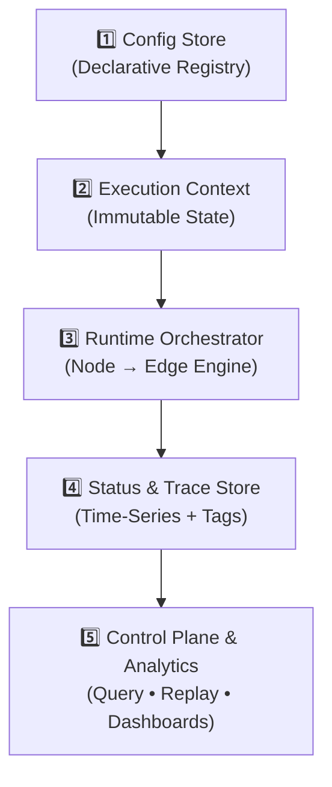
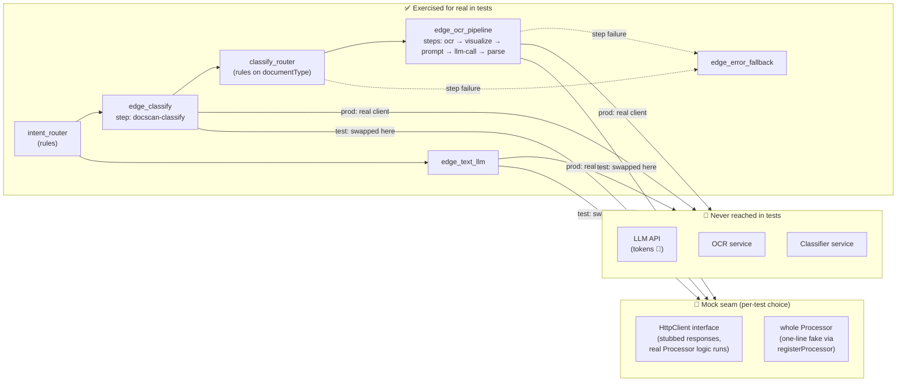

# AgentsGraph
AgentsGraph: Declarative AI orchestration where Nodes decide &amp; Edges execute pipelines. Config-driven graph architecture mapped to Agent Loops (Observe→Plan→Act→Reflect). Enterprise-ready, observable, and hot-reloadable via DB. Define complex agentic workflows in JSON or visually.

AgentsGraph follows a **5-layer declarative architecture** that strictly separates configuration, state, execution, and observability. This design enables hot-reloadable workflows, strict auditability, mock testing, feature drivene development and enterprise-grade operational control.


### 🔹 Layer Breakdown

**1️⃣ Config Store (Declarative Registry)**  
The single source of truth for workflow topology. Stored as versioned JSON in your database.
- `Node` definitions: Decision routers & AI classifiers
- `Edge` definitions: Executable pipelines (linear step chains)
- `routing_table` & JSON Schemas: Business logic & strict I/O contracts

**2️⃣ Execution Context (Immutable State)**  
A read-only data container that flows through the graph. Every step produces a new snapshot.
- Identifiers: `flow_id`, `trace_id`, `parent_id`
- Payload: `input_data`, `accumulated_state`
- Metadata: `{tenant_id, user_id, priority, channel, ...}`
- Schema versioning: `context_schema: "v1.2"` (ensures backward compatibility)

**3️ Runtime Orchestrator (Engine)**  
The core execution loop that maps conceptual Agent phases to technical components.
- `Node`: Evaluates context → Applies `routing_table` → Selects target `Edge`
- `Edge`: Receives mapped payload → Executes pipeline steps → Returns structured output
- Output: `updated_context` + `execution_event` (pushed to trace store)

**4️⃣ Status & Trace Store (Observability)**  
Time-series indexed storage for every execution lifecycle event.
- Tracking: `flow_id`, `status` (`running|completed|error|failed|paused`)
- Dynamic tagging: `tags: ["vip", "billing", "auto_routed", "needs_review"]`
- Telemetry: `{duration_ms, token_cost, step_count, retry_attempts}`
- Audit log: `[{node_id, routing_decision, timestamp, context_snapshot}]`

**5️⃣ Control Plane & Analytics**  
Operational interfaces built on top of the trace store.
-  **Query API**: `GET /executions?tags=vip&status=failed&tenant=acme`
- 🔄 **Replay & Debug**: `POST /replay?flow_id=exec_123&from_node=validator`
- 📈 **Dashboards**: Conversion rates, P95 latency, routing distribution, cost tracking

## 🧩 Project Modules

This repository is a multi-module Gradle 7 project (`agentsgraph-parent`) mirroring the 5-layer
architecture above. Each layer lives in its own module so it can be depended on independently;
`core` wires everything together with sane in-memory defaults.

| Module | Layer | Description | Depends on |
|---|---|---|---|
| `context` | Execution Context | Immutable `ExecutionContext` snapshot flowing through the graph: `flow_id`/`trace_id`/`parent_id`, `input_data`, `accumulated_state`, metadata, and schema version. | — |
| `config` | Config Store | Declarative registry: `NodeDefinition`, `EdgeDefinition`, `GraphDefinition`, `ProcessorDefinition`, routing tables/delegates, and the `ConfigStore`/`ProcessorDefinitionStore` abstractions, with in-memory, JSON (`config.json`) and JDBC (`config.jdbc`) implementations. | — |
| `trace` | Status & Trace Store | Execution audit log (`ExecutionEvent`, `TraceRecord`), lifecycle status, dynamic tags and telemetry counters, plus the `TraceStore` abstraction with in-memory and JDBC (`trace.jdbc`) implementations. | `context` |
| `engine` | Runtime Orchestrator | The Node → Edge execution engine (`RuntimeOrchestrator`, `Node`, `Edge`, `ConditionEngine`, `ProcessorRegistry`, `ProcessorLoader`, `RoutingDelegateRegistry`, `OutputSink`) mapping the Observe → Plan → Act → Reflect loop onto graph evaluation, with sync and async execution. | `config`, `context`, `trace` |
| `control` | Control Plane & Analytics | Query/replay API (`ControlPlane`) built on top of the trace store, backing `GET /executions` and replay/debug use cases, plus `GraphClassifier`/`TemplateGraphClassifier` for picking which graph should handle a given input. | `trace`, `context`, `config` |
| `core` | Facade | `AgentsGraphEngine` — a single entry point that deploys graphs, loads/reloads processors from the DB, runs flows (sync/async) and classifies inputs across all five layers. Constructed from `ConfigStore`/`ProcessorDefinitionStore`/`TraceStore` *implementations* — it never touches a `DataSource` or any other storage detail itself; each JDBC store ensures its own schema on construction. | all of the above |
| `test` | Test kit | `AgentsGraphTestHarness`, `MockProcessor` and `SqlScriptRunner` — run a real graph (deployed by the same SQL script production uses) with selected processors replaced by scripted mocks, so tests exercise routing/threading/fallback/tracing with zero network calls and zero AI-API token spend. | `core` |
| `web` | Admin API | `AgentsGraphAdminService` + `AgentsGraphAdminController` — the REST backend of the [AgentsGraph UI](https://github.com/Provision-Labs/agentsgraph-ui): graph list/JSON, graph-scoped processors, execution traces, debug step traces (parsed in/out) and resume-from-step, all read through the engine's own stores. Java 17 / Spring Framework 6. | `core` |
| `spring-boot-starter` | Starter | Auto-configuration: point a Spring Boot 3 app at a `DataSource` and get the three JDBC stores, the engine and the `/api/agentsgraph/**` admin API with zero wiring; every bean is `@ConditionalOnMissingBean`, so apps that wire their own stores/engine keep them. | `web` |
| `server` | Runnable server | `AgentsGraphServer` — the admin API server started straight from this build (`./gradlew :server:bootRun`): in-memory demo mode by default, database-backed via `spring.datasource.*`. Not published to Maven — it's an application, not a library. | `spring-boot-starter` |

Build with the bundled wrapper — no local Gradle install required:

```bash
./gradlew build      # Unix/macOS
gradlew.bat build     # Windows
```

Requires JDK 11+.

## 📦 Publishing

Every module publishes as `io.provisionlabs:agentsgraph-<module>` via the `maven-publish`
plugin (jar + sources jar). The target repository's URL and credentials are **not** committed -
they're read from a local, gitignored `local.properties` file:

```bash
cp local.properties.example local.properties
# then fill in publish.repoUrl / publish.repoUsername / publish.repoPassword
./gradlew publish
```

Works with any Maven-compatible repository (GitHub Packages, Nexus, Artifactory, ...) - see
`local.properties.example` for the exact keys and a GitHub Packages example. Without a
`local.properties`, `./gradlew build`/`test` are unaffected; only `publish` needs it.

Publishing to a plain `http://` repository (e.g. an internal Nexus/Artifactory only reachable
over an unencrypted private network) additionally needs `publish.allowInsecureProtocol=true` in
`local.properties` - Gradle otherwise refuses the publish as a safety guard rail. Leave it
unset/false for any `https://` repository.

The project version (see `gradle.properties`) currently ends in `-SNAPSHOT`. If your repository
manager splits releases and snapshots into separate repositories with different policies (Nexus's
`maven-releases` rejects SNAPSHOT versions with a 400 on `maven-metadata.xml`, for instance), set
`publish.snapshotRepoUrl` in `local.properties` to your snapshots repository's URL - SNAPSHOT
versions publish there instead of `publish.repoUrl` automatically.

## 🔌 Graph Config & Processor Loading

A pipeline is not a separate format bolted onto the graph - it **is** a graph: a single `Node`
unconditionally routed to a single `Edge` carrying an ordered list of steps. `config`'s `json` and
`jdbc` sub-packages give the graph itself everything a linear pipeline needs, in the framework's
own native JSON dialect (see [`examples/graphs/ocr-accounting.json`](examples/graphs/ocr-accounting.json)
for a full production-shaped pipeline - two `rules` routers, a classification edge and a 5-step
OCR/LLM pipeline, described in the Routing Specification below - and
[`examples/graphs/smart-intent-router.json`](examples/graphs/smart-intent-router.json)
for a delegate-routed one):

- **`GraphJsonMapper`** (`config.json`) is the (de)serializer for the whole `GraphDefinition` -
  nodes, edges, routing tables/delegates, input/output mappings, tags, and each step's
  `processor_id`/`params`/`output_to_next`/`output_to_save`. There is no adapter step: whatever
  this mapper reads is directly what the `RuntimeOrchestrator` runs.
- **`ProcessorJsonMapper`** (`config.json`) (de)serializes `ProcessorDefinition`s - see
  [`examples/processors/docscan-processors.json`](examples/processors/docscan-processors.json) -
  accepting `params` as either a nested JSON object or a raw JSON string (as stored in a `TEXT`
  column).
- **`JdbcConfigStore`** / **`JdbcProcessorDefinitionStore`** (`config.jdbc`) and **`JdbcTraceStore`**
  (`trace.jdbc`) are `DataSource`-based implementations of `ConfigStore`, `ProcessorDefinitionStore`
  and `TraceStore` — the same interfaces the in-memory reference implementations satisfy — so a
  deployment can back the framework onto Postgres (or any JDBC database) instead of memory without
  touching engine code. See [`examples/sql/docscan-schema.sql`](examples/sql/docscan-schema.sql)
  for the reference table schema and [`examples/sql/docscan-seed-data.sql`](examples/sql/docscan-seed-data.sql)
  for seed data loading the OCR-accounting graph; `config/src/test/resources/sql` has an
  H2-portable copy exercised by `SqlFixtureConfigStoreTest`. `JdbcTraceStore` persists
  status/tags/telemetry durably; the full per-node context-snapshot audit log stays in an
  in-process cache (see its Javadoc for the rationale).
- **`ProcessorLoader`** (`engine`) reflectively instantiates each `ProcessorDefinition`'s
  `instanceClass` via its no-arg constructor, calls `Processor.init(params)`, and registers it
  into a `ProcessorRegistry`. Failures are isolated per-processor rather than aborting the whole
  batch. `ProcessorHealthMonitor` reports liveness for processors flagged `is_external`.
- **`output_to_next` / `output_to_save`** on each step control per-step data flow inside an
  `Edge`: `output_to_next` threads selected keys into the next step (empty/absent forwards
  everything); `output_to_save` is opt-in and collects keys into `EdgeResult.getSavedOutputs()` for
  an `OutputSink` (`NoopOutputSink` by default, `InMemoryOutputSink` for tests/inspection),
  independent of what continues down the pipeline.
- **DB-driven loading &amp; reload** is built into `AgentsGraphEngine` itself: graph configs and
  processor rows live in the database (seeded by plain SQL insert scripts - see
  `examples/sql/docscan-seed-data.sql`), and the engine materializes them lazily on the first
  `execute(graphId, context)` and again on demand via `reload()` (a changed
  `agentsgraph_processor` row takes effect after a reload; a changed `agentsgraph_graph_config`
  row takes effect on the very next execution, no reload needed, since the orchestrator resolves
  the graph from the `ConfigStore` per run). Processors registered via
  `engine.registerProcessor(ref, processor)` - the ones needing live, injected dependencies that
  can't be reflectively instantiated from a DB row - are pinned: re-applied after every load,
  overriding same-ref DB rows (an optional constructor overload takes them as a map, convenient
  for a declarative Spring `<map>`); tests reuse that same seam to overlay mock processors.

## ⚡ Synchronous & Asynchronous Execution

`RuntimeOrchestrator.run(graphId, context)` executes a flow synchronously; `runAsync(graphId,
context[, executor])` returns a `CompletableFuture<ExecutionContext>` on a configurable
`Executor` (defaulting to `ForkJoinPool.commonPool()`). Both share the same `TraceStore`, so a
flow's live status/tags/telemetry are visible the same way regardless of which one is used.
`AgentsGraphEngine` exposes both as `execute(...)` / `executeAsync(...)`.

## 🧭 Graph Selection

`control.GraphClassifier` is a small, transport-agnostic seam — `String classify(Map<String,
Object> input)` — for picking which deployed graph should handle a given input, so an upstream
integration doesn't need to hardcode a graph id. `TemplateGraphClassifier` is a reference
implementation matching a graph's declared `templates` (see `GraphDefinition.getTemplates()`)
against an input's `hasFile` flag and a short classification tag, with configurable fallback
graph ids. `AgentsGraphEngine.createTemplateGraphClassifier(...)` wires one up over the engine's
own `ConfigStore`.

## 🗺️ Roadmap

- **Chat bot integration**: `GraphClassifier` and `executeAsync` are designed as the building
  blocks a future chat-bot front end (equivalent to a `PipelineChatBot`) would sit on top of —
  classify a request into a graph id, run it async, and surface `TraceStore` status while it
  runs. That integration itself is out of scope for this repository and is planned separately.

##  Routing Specification

AgentsGraph supports two routing strategies per Node: **Declarative Rules** and **Abstract Delegates**. This enables mixing deterministic business logic with external AI/ML services while maintaining fallback safety.

### 🔹 Routing Strategies

| Strategy | Type | Use Case | Config Key |
|:---|:---|:---|:---|
| `rules` | Declarative | Simple conditions, deterministic routing, rule-based engines | `routing_table` |
| `classificator` (alias: `classifier`) | Delegated | External ML models, complex Java services, Human-in-the-loop, LLM routers | `routing_delegate` |

---

### Rules Configuration

When `routing_strategy: "rules"`, the `ConditionEngine` evaluates the node's `routing_table` -
an ordered map of `"path==value"` equality conditions against a merged view of
`accumulated_state` (highest priority) and `input_data`. Paths use dots to descend into nested
maps (`user.tier==vip`). The literal key `"default"` matches unconditionally and is always
evaluated last, acting as a catch-all. If nothing matches and there is no `default`, the node
falls back to `fallback_edge_id` (or the flow fails if none is set).

Because conditions read the accumulated context, a `rules` node placed *after* an edge can route
on that edge's own output - so a "classify then route on the result" flow needs no custom routing
code at all: run classification as a normal edge step, save its result, and route on it
declaratively (see the pipeline example below).

```json
{
  "id": "classify_router",
  "routing_strategy": "rules",
  "routing_table": {
    "documentType==passport": "edge_name_value_pipeline",
    "documentType==handwritten": "edge_manual_review",
    "default": "edge_ocr_pipeline"
  },
  "fallback_edge_id": "edge_error_fallback"
}
```

### Classificator Configuration

When `routing_strategy: "classificator"`, the Node delegates decision-making to a
`RoutingDelegate` implementation registered in the engine's `RoutingDelegateRegistry` under
`routing_delegate.ref` (`engine.registerRoutingDelegate(ref, delegate)`). The delegate receives
the full `ExecutionContext` plus the declarative `routing_delegate` config and returns a
`DelegateResult`: the chosen `edgeId`, a `confidence`, and an optional `raw` output map.

```json
{
  "id": "smart_intent_router",
  "type": "classifier",
  "routing_strategy": "classificator",

  "routing_delegate": {
    "type": "model_service",
    "ref": "llm_intent_classifier_v4",
    "params": {
      "temperature": 0.1,
      "supportEdgeId": "edge_support",
      "salesEdgeId": "edge_sales"
    },
    "timeout_ms": 3000
  },

  "output_mapping": {
    "intent": "classification.intent",
    "confidence": "classification.confidence"
  },

  "fallback_edge_id": "pipe_error_handler"
}
```

What the runtime actually guarantees:

- **Fallback safety**: if the delegate throws, returns `null`, or returns no `edgeId`, the node
  routes to `fallback_edge_id` instead of failing the flow (and only fails if none is set). The
  same `fallback_edge_id` also covers a *successfully routed* edge whose own step pipeline later
  throws - the orchestrator re-routes to the fallback edge with the failure message merged into
  the context under `pipeline_error`, so the graph can shape a user-facing error response.
- **Fallback IS an error**: *any* `fallback_edge_id` activation - routing fallback or edge-step
  failure - is treated as a failure, not silently absorbed: it's logged through SLF4J with the
  original exception attached (never lost in wrapper layers), the failure reason/stack trace is
  persisted into the trace record's `error` field, and the flow finishes with status `error`
  (never `completed`). A failure with no fallback configured propagates with its cause attached
  and leaves the flow `failed`.
- **`output_mapping`** projects the delegate's `raw` output map into the context *before* the
  selected edge runs: each mapping key is a key in `DelegateResult.getRaw()`, each value is the
  context key it's stored under. Downstream steps read the classification the same way they read
  any other accumulated state. (The chosen `edge_id`/`confidence` are not part of `raw` - they're
  recorded per-node in the Trace Store's audit log as the `RoutingOutcome`.)
- **Audit**: every routing decision (edge id, confidence, source: `RULES`/`DELEGATE`/`FALLBACK`)
  is appended to the Trace Store together with a context snapshot.

What the runtime deliberately does **not** do (the delegate's responsibility):

- `params` and `timeout_ms` are passed through to the delegate verbatim - the runtime doesn't
  interpret them or enforce the timeout; a delegate wrapping a network call should apply
  `timeout_ms` to its own client.
- The returned `edgeId` isn't validated against a whitelist - an id that doesn't exist in the
  graph simply fails edge lookup (which the fallback above does *not* cover, since routing itself
  succeeded). Keep edge ids in `params` (as in the example) so graph JSON stays the single source
  of truth for topology.

> 💡 **Prefer a plain step + `rules` router when possible.** A `RoutingDelegate` couples
> classification and routing into one non-declarative unit. If the classification result can be
> expressed as context keys, run it as a normal edge step (`output_to_save`) and route on the
> result with a `rules` node instead - the classifier then shares the same processor lifecycle,
> DB-driven configuration, per-step tracing and `fallback_edge_id` error handling as every other
> step, and tests can swap it for a one-line fake `Processor`. That is exactly how
> [`examples/graphs/ocr-accounting.json`](examples/graphs/ocr-accounting.json) is structured -
> reserve `classificator` for cases where the routing decision itself genuinely can't be
> declarative (human-in-the-loop, dynamic edge sets).

### Reference pipeline example

[`examples/graphs/ocr-accounting.json`](examples/graphs/ocr-accounting.json) is a complete,
production-shaped document-processing graph exercising all of the above - two `rules` routers, a
classification edge feeding the second router, a 5-step OCR/LLM pipeline with per-step
`output_to_next`/`output_to_save` threading, and a shared error-fallback edge:

```
                    hasFile==false --> edge_text_llm       (plain LLM answer)
input --> intent_router
 (rules)            hasFile==true  --> edge_classify       (document classifier step)
                                          --> classify_router (rules on documentType)
                                                --default--> edge_ocr_pipeline
                                                               (OCR -> visualization ->
                                                                prompt prep -> LLM call -> parse)

any step failure --> edge_error_fallback (user-facing error message)
```

Note how `edge_classify` saves `documentType` into the context and `classify_router` routes on it
declaratively, and how `output_to_next` between steps of the same edge *replaces* what the next
step sees (an empty/absent list forwards everything) - a step must explicitly re-forward keys a
later step still needs.

## 🐛 Debug Mode: Step-Level Tracing & Resume

Normal tracing records per-node snapshots; **debug mode** goes one level deeper - every *step*
inside every edge is recorded into the `TraceStore`'s step-level trace (`agentsgraph_step_trace` when JDBC-backed)
with the FULL context it saw on input, its raw output, timing, and - on failure - the stack trace:

```java
ExecutionContext result = engine.executeDebug("ocr-accounting", context); // or metadata agentsgraph_debug=true
List<StepTraceRecord> steps = engine.getStepTraces(result.getFlowId());   // execution order (seq)
```

Because each record's input snapshot is the *complete* context (not a delta), every step is an
independent restart point. `resumeFrom` rebuilds the context from the recorded snapshot and
re-enters the graph at exactly that step - earlier steps (e.g. an expensive OCR call) do **not**
run again:

```java
// The flow failed at the LLM step? Fix the processor (or the data), then:
ExecutionContext resumed = engine.resumeFrom(flowId, failedStep.getSeq());
// ...or resume on corrected data without re-running anything upstream:
engine.resumeFrom(flowId, seq, Map.of("json", correctedOcrJson));
```

The resumed run is a NEW flow (metadata carries `parent_flow_id`/`resumed_from_seq` for lineage),
runs in debug mode itself (so it can be resumed again), and executes everything from the resume
point **live** - replaying recorded answers instead is what the `agentsgraph-test` mock harness
is for (`harness.executeDebug` / `harness.stepTraces` / `harness.resumeFrom` wrap the same API).

What to know before relying on it:

- **Zero overhead when off**: a non-debug run never touches the step-trace store - the tracer is
  a no-op singleton.
- **Serialization is defensive, per value** (`ContextJsonCodec`): `byte[]` round-trips via base64;
  a value Jackson can't serialize becomes an `__unserializable__` placeholder; a value over the
  size limit (1 MB by default) becomes `__truncated__`. Either marker flags the record
  `restartable=false` - still fully inspectable, but `resumeFrom` refuses it.
- **Type fidelity**: plain JSON-like values (maps, lists, strings, numbers, booleans, `byte[]`)
  round-trip exactly; rich POJOs come back as `Map`s on resume.
- **Version pinning**: each record stores the graph version it ran against; resuming after the
  graph changed logs a warning and executes against the CURRENT graph.
- **Retention**: `traceStore.deleteStepsOlderThan(epochMillis)` - debug traces are heavyweight by
  design; clean them up.

### Dump, inspect, replay

Three tools turn a recorded debug run into a shareable, reproducible artifact:

```java
String dump   = engine.dumpStepTraces(flowId);   // self-contained JSON - attach to the bug report
String report = engine.describeFlow(flowId);     // plain-text status + step table - the payload
                                                 // for your admin endpoint / actuator / CLI
```

`describeFlow` works for any flow (for a non-debug one it reports status/tags/error and says step
traces are absent); the framework deliberately ships the *report*, not the HTTP endpoint - expose
it through whatever ops surface the application already has.

The dump closes the loop with the test kit: `harness.mocksFromDump(dump)` registers a
`MockProcessor.returningSequence` for every processor that succeeded in the recording, answering
with the recorded outputs in the recorded order - so a flow captured against production replays
locally with the exact same external-service answers and zero network. A recorded *failure* is
deliberately not replayed: fix the processor, replay the run, and every upstream answer stays as
it was.

```java
// CI regression test from a production incident:
harness.mocksFromDump(dumpJson, "docscan-ocr", "llm-completion"); // only the external steps
ExecutionContext replayed = harness.execute("ocr-accounting", originalInput);
```

## 🖥️ Building & Running the Admin API Server

The `web` + `spring-boot-starter` modules turn any Spring Boot 3 application (Java 17) into the
backend of the [AgentsGraph UI](https://github.com/Provision-Labs/agentsgraph-ui) - the
`/api/agentsgraph/**` REST API over graphs, processors, execution traces, step-level debug and
resume. This repository ships one ready to run - the [`server`](server) module:

```bash
./gradlew :server:bootRun
curl http://localhost:8080/api/agentsgraph/graphs
```

By default it runs in pure in-memory mode, pre-seeded with a demo graph plus one successful and
one failed debug run - so the AgentsGraph UI has graphs, executions and a resumable failed step
to show immediately. Switching it to a real database is a two-line change (uncomment
`spring-boot-starter-jdbc` + the driver in [`server/build.gradle`](server/build.gradle), set
`spring.datasource.*` in [`application.properties`](server/src/main/resources/application.properties) -
the demo in-memory beans back off automatically when a `DataSource` appears).

For your own application, a minimal server is one build file and one class:

```gradle
// build.gradle of your server project
plugins {
    id 'java'
    id 'org.springframework.boot' version '3.5.15'
    id 'io.spring.dependency-management' version '1.1.7'
}
java { sourceCompatibility = JavaVersion.VERSION_17 }
repositories {
    mavenCentral()
    maven { url = 'https://your-nexus/repository/maven-releases/' }  // where agentsgraph-* is published
}
dependencies {
    implementation 'org.springframework.boot:spring-boot-starter-web'
    implementation 'org.springframework.boot:spring-boot-starter-jdbc'   // provides the DataSource (DB modes)
    implementation 'io.provisionlabs:agentsgraph-spring-boot-starter:0.4.0'
    runtimeOnly 'org.postgresql:postgresql'   // or com.h2database:h2 for the in-memory database
}
```

```java
@SpringBootApplication
public class AgentsGraphServer {
    public static void main(String[] args) {
        SpringApplication.run(AgentsGraphServer.class, args);
    }
}
```

Build and run:

```bash
./gradlew build
./gradlew bootRun
curl http://localhost:8080/api/agentsgraph/graphs   # -> [] on an empty database
```

### Database-backed (production shape)

Point the application at the database - nothing else. The starter auto-configures
`JdbcConfigStore`/`JdbcProcessorDefinitionStore`/`JdbcTraceStore` over the `DataSource` (each
provisions its own `agentsgraph_*` schema on startup), the engine, and the REST API:

```properties
# application.properties
spring.datasource.url=jdbc:postgresql://localhost:5432/docscan
spring.datasource.username=docscan
spring.datasource.password=...

# Only when the UI dev server runs on another origin (npm start on :4200):
agentsgraph.web.cors-origins=http://localhost:4200
```

Deploy graphs and processors the DB-first way - the same SQL scripts production uses (`INSERT
INTO agentsgraph_graph_config / agentsgraph_processor ...`, see `examples/sql/docscan-schema.sql`
and WebVane's `db/postgres/docscan_graph/data.sql`); the engine picks up config changes without
a restart (graphs on the next execution, processor rows after `engine.reload()`).

**In-memory *database* variant** - zero install, still exercises the real JDBC stores (data lives
until the JVM exits):

```properties
spring.datasource.url=jdbc:h2:mem:agentsgraph;MODE=PostgreSQL;DB_CLOSE_DELAY=-1
spring.datasource.username=sa
```

`MODE=PostgreSQL` lets the production PostgreSQL deployment scripts run verbatim against H2 -
exactly what the `agentsgraph-test` harness does.

### Pure in-memory stores (no database at all)

Every starter bean is `@ConditionalOnMissingBean`, so defining your own engine switches the whole
stack to in-memory stores while the starter still contributes the admin service/controller around
it - handy for demos and UI development:

```java
@SpringBootApplication
public class AgentsGraphServer {

    public static void main(String[] args) {
        SpringApplication.run(AgentsGraphServer.class, args);
    }

    @Bean
    public AgentsGraphEngine agentsGraphEngine() {
        AgentsGraphEngine engine = AgentsGraphEngine.inMemory();
        engine.registerProcessor("echo", (context, step) ->
                Map.of("answer", "echo: " + context.getInputData().get("text")));
        engine.deployGraph(GraphJsonMapper.fromJson("{"
                + "\"id\": \"demo\", \"version\": \"v1\", \"entry_node_id\": \"n0\","
                + "\"nodes\": [{\"id\": \"n0\", \"routing_strategy\": \"rules\", \"routing_table\": {\"default\": \"e0\"}}],"
                + "\"edges\": [{\"id\": \"e0\", \"steps\": [{\"id\": \"s0\", \"processor_id\": \"echo\"}]}]"
                + "}"));
        return engine;
    }
}
```

(No `spring-boot-starter-jdbc`/driver dependency needed in this mode.) Executions and debug step
traces are recorded in process memory and vanish on restart. Trigger a debug run to have
something to look at in the UI:

```java
engine.executeDebug("demo", ExecutionContext.newFlow(Map.of("text", "hello"), Map.of()));
```

### Hooking up the UI

```bash
git clone https://github.com/Provision-Labs/agentsgraph-ui && cd agentsgraph-ui
npm install
npm start        # ng serve, proxies /api -> http://localhost:8080
```

Open http://localhost:4200 - graphs, processors, executions and (for debug-mode flows) the
step-level in/out viewer with resume-from-step.

### An existing application as the backend

An app that already wires its own stores/engine (e.g. WebVane's docscan module via Spring XML)
just adds the starter dependency: `@ConditionalOnMissingBean` keeps every existing bean, and only
the missing admin service/controller are contributed on top of them.

## 🧪 Testing Without AI APIs

A graph whose steps call LLM/OCR/classification services is still, above the wire, deterministic
routing and data-threading logic - and that is exactly what tests should exercise. Because every
external call is a `Processor` resolved by ref from the `ProcessorRegistry` (never constructed
inside the engine), tests swap the *boundary* without touching graph config or engine code, and
run the full flow - routing, `output_to_next`/`output_to_save` threading, `fallback_edge_id`
error paths, tracing, tags - with **zero network calls and zero AI-API token spend**.



Two mock depths, chosen per test:

- **Mock the HTTP client, run the real `Processor`** - the processor takes its HTTP client via
  constructor injection (keeping a no-arg constructor for `ProcessorLoader`'s reflective loading)
  and the test hands it a stub scripted with canned JSON responses per URL. The processor's real
  logic - URL templating, request shaping, response parsing, caching, retry/backoff - actually
  executes; only the socket is fake. This is the default: a test that mocks the whole processor
  would only ever test the mock.

  ```java
  StubHttpClient http = new StubHttpClient()
      .withResponse("http://classify/api",  "{\"template\":\"invoice\",\"prob\":0.95}")
      .withResponse("http://ocr/process",   "{\"documents\":[...]}")
      .withResponse("http://llm/completion","{\"content\":\"SUMMARY\"}");

  engine.registerProcessor("docscan-classify", new DocumentClassifyProcessor(new HttpClassifierClient(http, url)));
  engine.registerProcessor("docscan-ocr",      new DocscanOcrProcessor(http));
  engine.registerProcessor("llm-completion",   new LlmCompletionProcessor(http));

  ExecutionContext result = engine.execute("ocr-accounting", input);   // full graph, no network
  ```

- **Mock the whole `Processor`** - when a test doesn't care about a step's internals at all
  (e.g. a routing-focused test that only needs *a* classification in the context), replace the
  step with a one-line lambda:

  ```java
  engine.registerProcessor("docscan-classify",
      (ctx, step) -> Map.of("documentType", "invoice", "confidence", 0.95));
  ```

Failure paths cost nothing to simulate either: simply *don't* stub a URL (the client throws →
the edge fails → the orchestrator re-routes to `fallback_edge_id` with `pipeline_error` in the
context), and assert on the fallback edge's output and the `needs_review` tag in the
`TraceStore`. JDBC-backed stores over an in-memory H2 `DataSource` round this out into a fully
self-contained integration test - real engine, real stores, real processors, fake wire.

The **`agentsgraph-test` module** packages all of this as a ready-made kit:

```java
AgentsGraphTestHarness harness = AgentsGraphTestHarness.jdbc(h2DataSource)
    .runSqlScript("/db/postgres/docscan_graph/graphs.sql");   // the SAME script production deploys with

MockProcessor llm = harness.mockProcessor("llm-completion", Map.of("llmContent", "ANSWER"));
harness.failProcessor("docscan-ocr", "OCR down");             // or simulate an outage

ExecutionContext result = harness.execute("ocr-accounting", Map.of("hasFile", true));
assertThat(llm.invocationCount()).isEqualTo(1);               // mocks record every invocation
assertThat(harness.trace(result).getTags()).contains("needs_review");
```

`MockProcessor.returning/failing/answering` scripts a step's behaviour and records each incoming
`ExecutionContext`; `SqlScriptRunner` applies a production SQL deployment script to the mock
database; the harness registers mocks as the engine's pinned programmatic processors, so they
override same-ref DB rows and survive `reload()` - the same seam a production deployment uses for
processors with live, injected dependencies. See the docscan reference deployment's test suite
for these patterns applied to [`examples/graphs/ocr-accounting.json`](examples/graphs/ocr-accounting.json).

### 🔄 Mapping to the Agent Loop

| Agent Loop Phase | AgentsGraph Component | Responsibility |
|------------------|-----------------------|----------------|
| 👁️ **Observe**   | `ExecutionContext.input` + `Node.input_mapping` | Data ingestion & schema validation |
| 🧠 **Plan**      | `Node.routing_table` + Condition Engine | Decision making & next-step selection |
| ⚡ **Act**       | `Edge.steps` + `processor_registry` | Pipeline execution & external calls |
|  **Reflect**   | `Edge.output_mapping` + `tags_to_add` + `Status Store` | Result evaluation, tagging & audit |

> 💡 **Key Advantage**: Unlike code-first frameworks where routing logic is scattered across `if/else` blocks, AgentsGraph centralizes decision-making in the `Node` and isolates execution in reusable `Edge` pipelines. This enables hot-reloads, strict auditing, and non-technical workflow management.

## 📄 License

Licensed under the [Apache License, Version 2.0](LICENSE).
