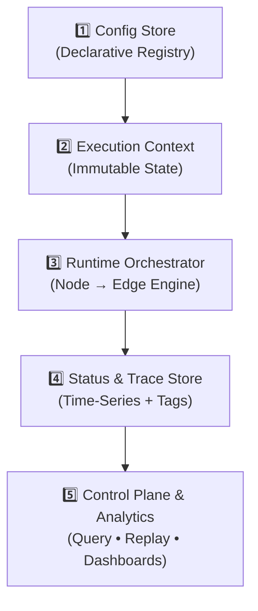

# AgentsGraph
AgentsGraph: Declarative AI orchestration where Nodes decide &amp; Edges execute pipelines. Config-driven graph architecture mapped to Agent Loops (Observe→Plan→Act→Reflect). Enterprise-ready, observable, and hot-reloadable via DB. Define complex agentic workflows in JSON or visually.

AgentsGraph follows a **5-layer declarative architecture** that strictly separates configuration, state, execution, and observability. This design enables hot-reloadable workflows, strict auditability, and enterprise-grade operational control.


### 🔹 Layer Breakdown

**1️⃣ Config Store (Declarative Registry)**  
The single source of truth for workflow topology. Stored as versioned JSON in your database.
- `Node` definitions: Decision routers & AI classifiers
- `Edge` definitions: Executable pipelines (linear step chains)
- `routing_table` & JSON Schemas: Business logic & strict I/O contracts

**2️⃣ Execution Context (Immutable State)**  
A read-only data container that flows through the graph. Every step produces a new snapshot.
- Identifiers: `flow_id`, `trace_id`, `parent_id`
- Payload: `input_data`, `accumulated_state`
- Metadata: `{tenant_id, user_id, priority, channel, ...}`
- Schema versioning: `context_schema: "v1.2"` (ensures backward compatibility)

**3️ Runtime Orchestrator (Engine)**  
The core execution loop that maps conceptual Agent phases to technical components.
- `Node`: Evaluates context → Applies `routing_table` → Selects target `Edge`
- `Edge`: Receives mapped payload → Executes pipeline steps → Returns structured output
- Output: `updated_context` + `execution_event` (pushed to trace store)

**4️⃣ Status & Trace Store (Observability)**  
Time-series indexed storage for every execution lifecycle event.
- Tracking: `flow_id`, `status` (`running|completed|failed|paused`)
- Dynamic tagging: `tags: ["vip", "billing", "auto_routed", "needs_review"]`
- Telemetry: `{duration_ms, token_cost, step_count, retry_attempts}`
- Audit log: `[{node_id, routing_decision, timestamp, context_snapshot}]`

**5️⃣ Control Plane & Analytics**  
Operational interfaces built on top of the trace store.
-  **Query API**: `GET /executions?tags=vip&status=failed&tenant=acme`
- 🔄 **Replay & Debug**: `POST /replay?flow_id=exec_123&from_node=validator`
- 📈 **Dashboards**: Conversion rates, P95 latency, routing distribution, cost tracking

##  Routing Specification

AgentsGraph supports two routing strategies per Node: **Declarative Rules** and **Abstract Delegates**. This enables mixing deterministic business logic with external AI/ML services while maintaining strict control, validation, and fallback safety.

### 🔹 Routing Strategies

| Strategy | Type | Use Case | Config Key |
|:---|:---|:---|:---|
| `rules` | Declarative | Simple conditions, deterministic routing, rule-based engines | `routing_table` |
| `classifier` | Delegated | External ML models, complex Java services, Human-in-the-loop, LLM routers | `routing_delegate` |

---

###  Classificator Configuration

When `routing_strategy: "classificator"`, the Node delegates decision-making to an external module. The runtime enforces strict contracts, validates outputs against graph topology, and guarantees fallback paths.

```json
{
  "id": "smart_intent_router",
  "type": "classifier",
  "routing_strategy": "classificator",
  
  "routing_delegate": {
    "type": "model_service",
    "ref": "llm_intent_classifier_v4",
    "params": {
      "temperature": 0.1,
      "allowed_edges": ["edge_support", "edge_sales", "edge_billing"]
    },
    "timeout_ms": 3000
  },

  "output_mapping": {
    "delegate_result.edge_id": "routing_decision.next_edge",
    "delegate_result.confidence": "routing_decision.confidence"
  },

  "fallback_edge_id": "pipe_error_handler"
}

```

### 🔄 Mapping to the Agent Loop

| Agent Loop Phase | AgentsGraph Component | Responsibility |
|------------------|-----------------------|----------------|
| 👁️ **Observe**   | `ExecutionContext.input` + `Node.input_mapping` | Data ingestion & schema validation |
| 🧠 **Plan**      | `Node.routing_table` + Condition Engine | Decision making & next-step selection |
| ⚡ **Act**       | `Edge.steps` + `processor_registry` | Pipeline execution & external calls |
|  **Reflect**   | `Edge.output_mapping` + `tags_to_add` + `Status Store` | Result evaluation, tagging & audit |

> 💡 **Key Advantage**: Unlike code-first frameworks where routing logic is scattered across `if/else` blocks, AgentsGraph centralizes decision-making in the `Node` and isolates execution in reusable `Edge` pipelines. This enables hot-reloads, strict auditing, and non-technical workflow management.
