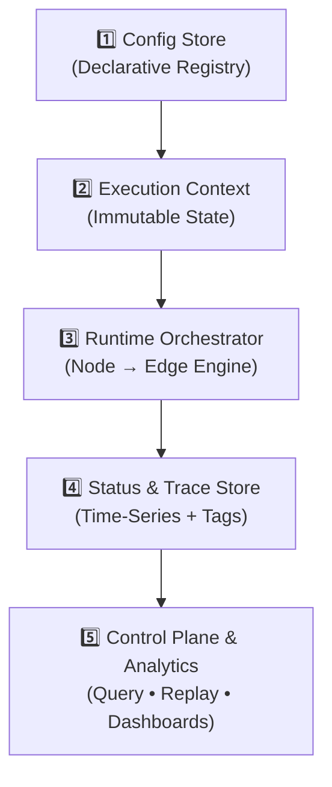

# AgentsGraph
AgentsGraph: Declarative AI orchestration where Nodes decide &amp; Edges execute pipelines. Config-driven graph architecture mapped to Agent Loops (Observe→Plan→Act→Reflect). Enterprise-ready, observable, and hot-reloadable via DB. Define complex agentic workflows in JSON or visually.

AgentsGraph follows a **5-layer declarative architecture** that strictly separates configuration, state, execution, and observability. This design enables hot-reloadable workflows, strict auditability, and enterprise-grade operational control.


### 🔹 Layer Breakdown

**1️⃣ Config Store (Declarative Registry)**  
The single source of truth for workflow topology. Stored as versioned JSON in your database.
- `Node` definitions: Decision routers & AI classifiers
- `Edge` definitions: Executable pipelines (linear step chains)
- `routing_table` & JSON Schemas: Business logic & strict I/O contracts

**2️⃣ Execution Context (Immutable State)**  
A read-only data container that flows through the graph. Every step produces a new snapshot.
- Identifiers: `flow_id`, `trace_id`, `parent_id`
- Payload: `input_data`, `accumulated_state`
- Metadata: `{tenant_id, user_id, priority, channel, ...}`
- Schema versioning: `context_schema: "v1.2"` (ensures backward compatibility)

**3️ Runtime Orchestrator (Engine)**  
The core execution loop that maps conceptual Agent phases to technical components.
- `Node`: Evaluates context → Applies `routing_table` → Selects target `Edge`
- `Edge`: Receives mapped payload → Executes pipeline steps → Returns structured output
- Output: `updated_context` + `execution_event` (pushed to trace store)

**4️⃣ Status & Trace Store (Observability)**  
Time-series indexed storage for every execution lifecycle event.
- Tracking: `flow_id`, `status` (`running|completed|failed|paused`)
- Dynamic tagging: `tags: ["vip", "billing", "auto_routed", "needs_review"]`
- Telemetry: `{duration_ms, token_cost, step_count, retry_attempts}`
- Audit log: `[{node_id, routing_decision, timestamp, context_snapshot}]`

**5️⃣ Control Plane & Analytics**  
Operational interfaces built on top of the trace store.
-  **Query API**: `GET /executions?tags=vip&status=failed&tenant=acme`
- 🔄 **Replay & Debug**: `POST /replay?flow_id=exec_123&from_node=validator`
- 📈 **Dashboards**: Conversion rates, P95 latency, routing distribution, cost tracking

## 🧩 Project Modules

This repository is a multi-module Gradle 7 project (`agentsgraph-parent`) mirroring the 5-layer
architecture above. Each layer lives in its own module so it can be depended on independently;
`core` wires everything together with sane in-memory defaults.

| Module | Layer | Description | Depends on |
|---|---|---|---|
| `context` | Execution Context | Immutable `ExecutionContext` snapshot flowing through the graph: `flow_id`/`trace_id`/`parent_id`, `input_data`, `accumulated_state`, metadata, and schema version. | — |
| `config` | Config Store | Declarative registry: `NodeDefinition`, `EdgeDefinition`, `GraphDefinition`, `ProcessorDefinition`, routing tables/delegates, and the `ConfigStore`/`ProcessorDefinitionStore` abstractions, with in-memory, JSON (`config.json`) and JDBC (`config.jdbc`) implementations. | — |
| `trace` | Status & Trace Store | Execution audit log (`ExecutionEvent`, `TraceRecord`), lifecycle status, dynamic tags and telemetry counters, plus the `TraceStore` abstraction with in-memory and JDBC (`trace.jdbc`) implementations. | `context` |
| `engine` | Runtime Orchestrator | The Node → Edge execution engine (`RuntimeOrchestrator`, `Node`, `Edge`, `ConditionEngine`, `ProcessorRegistry`, `ProcessorLoader`, `RoutingDelegateRegistry`, `OutputSink`) mapping the Observe → Plan → Act → Reflect loop onto graph evaluation, with sync and async execution. | `config`, `context`, `trace` |
| `control` | Control Plane & Analytics | Query/replay API (`ControlPlane`) built on top of the trace store, backing `GET /executions` and replay/debug use cases, plus `GraphClassifier`/`TemplateGraphClassifier` for picking which graph should handle a given input. | `trace`, `context`, `config` |
| `core` | Facade | `AgentsGraphEngine` — a single entry point that deploys graphs, loads processors, runs flows (sync/async) and classifies inputs across all five layers. | all of the above |

Build with the bundled wrapper — no local Gradle install required:

```bash
./gradlew build      # Unix/macOS
gradlew.bat build     # Windows
```

Requires JDK 11+.

## 📦 Publishing

Every module publishes as `io.provisionlabs:agentsgraph-<module>` via the `maven-publish`
plugin (jar + sources jar). The target repository's URL and credentials are **not** committed -
they're read from a local, gitignored `local.properties` file:

```bash
cp local.properties.example local.properties
# then fill in publish.repoUrl / publish.repoUsername / publish.repoPassword
./gradlew publish
```

Works with any Maven-compatible repository (GitHub Packages, Nexus, Artifactory, ...) - see
`local.properties.example` for the exact keys and a GitHub Packages example. Without a
`local.properties`, `./gradlew build`/`test` are unaffected; only `publish` needs it.

## 🔌 Graph Config & Processor Loading

A pipeline is not a separate format bolted onto the graph - it **is** a graph: a single `Node`
unconditionally routed to a single `Edge` carrying an ordered list of steps. `config`'s `json` and
`jdbc` sub-packages give the graph itself everything a linear pipeline needs, in the framework's
own native JSON dialect (see [`examples/graphs/ocr-accounting.json`](examples/graphs/ocr-accounting.json)
for a full pipeline example and [`examples/graphs/smart-intent-router.json`](examples/graphs/smart-intent-router.json)
for a branching, delegate-routed one):

- **`GraphJsonMapper`** (`config.json`) is the (de)serializer for the whole `GraphDefinition` -
  nodes, edges, routing tables/delegates, input/output mappings, tags, and each step's
  `processor_id`/`params`/`output_to_next`/`output_to_save`. There is no adapter step: whatever
  this mapper reads is directly what the `RuntimeOrchestrator` runs.
- **`ProcessorJsonMapper`** (`config.json`) (de)serializes `ProcessorDefinition`s - see
  [`examples/processors/docscan-processors.json`](examples/processors/docscan-processors.json) -
  accepting `params` as either a nested JSON object or a raw JSON string (as stored in a `TEXT`
  column).
- **`JdbcConfigStore`** / **`JdbcProcessorDefinitionStore`** (`config.jdbc`) and **`JdbcTraceStore`**
  (`trace.jdbc`) are `DataSource`-based implementations of `ConfigStore`, `ProcessorDefinitionStore`
  and `TraceStore` — the same interfaces the in-memory reference implementations satisfy — so a
  deployment can back the framework onto Postgres (or any JDBC database) instead of memory without
  touching engine code. See [`examples/sql/docscan-schema.sql`](examples/sql/docscan-schema.sql)
  for the reference table schema and [`examples/sql/docscan-seed-data.sql`](examples/sql/docscan-seed-data.sql)
  for seed data loading the OCR-accounting graph; `config/src/test/resources/sql` has an
  H2-portable copy exercised by `SqlFixtureConfigStoreTest`. `JdbcTraceStore` persists
  status/tags/telemetry durably; the full per-node context-snapshot audit log stays in an
  in-process cache (see its Javadoc for the rationale).
- **`ProcessorLoader`** (`engine`) reflectively instantiates each `ProcessorDefinition`'s
  `instanceClass` via its no-arg constructor, calls `Processor.init(params)`, and registers it
  into a `ProcessorRegistry`. Failures are isolated per-processor rather than aborting the whole
  batch. `ProcessorHealthMonitor` reports liveness for processors flagged `is_external`.
- **`output_to_next` / `output_to_save`** on each step control per-step data flow inside an
  `Edge`: `output_to_next` threads selected keys into the next step (empty/absent forwards
  everything); `output_to_save` is opt-in and collects keys into `EdgeResult.getSavedOutputs()` for
  an `OutputSink` (`NoopOutputSink` by default, `InMemoryOutputSink` for tests/inspection),
  independent of what continues down the pipeline.

## ⚡ Synchronous & Asynchronous Execution

`RuntimeOrchestrator.run(graphId, context)` executes a flow synchronously; `runAsync(graphId,
context[, executor])` returns a `CompletableFuture<ExecutionContext>` on a configurable
`Executor` (defaulting to `ForkJoinPool.commonPool()`). Both share the same `TraceStore`, so a
flow's live status/tags/telemetry are visible the same way regardless of which one is used.
`AgentsGraphEngine` exposes both as `execute(...)` / `executeAsync(...)`.

## 🧭 Graph Selection

`control.GraphClassifier` is a small, transport-agnostic seam — `String classify(Map<String,
Object> input)` — for picking which deployed graph should handle a given input, so an upstream
integration doesn't need to hardcode a graph id. `TemplateGraphClassifier` is a reference
implementation matching a graph's declared `templates` (see `GraphDefinition.getTemplates()`)
against an input's `hasFile` flag and a short classification tag, with configurable fallback
graph ids. `AgentsGraphEngine.createTemplateGraphClassifier(...)` wires one up over the engine's
own `ConfigStore`.

## 🗺️ Roadmap

- **Chat bot integration**: `GraphClassifier` and `executeAsync` are designed as the building
  blocks a future chat-bot front end (equivalent to a `PipelineChatBot`) would sit on top of —
  classify a request into a graph id, run it async, and surface `TraceStore` status while it
  runs. That integration itself is out of scope for this repository and is planned separately.

##  Routing Specification

AgentsGraph supports two routing strategies per Node: **Declarative Rules** and **Abstract Delegates**. This enables mixing deterministic business logic with external AI/ML services while maintaining strict control, validation, and fallback safety.

### 🔹 Routing Strategies

| Strategy | Type | Use Case | Config Key |
|:---|:---|:---|:---|
| `rules` | Declarative | Simple conditions, deterministic routing, rule-based engines | `routing_table` |
| `classifier` | Delegated | External ML models, complex Java services, Human-in-the-loop, LLM routers | `routing_delegate` |

---

###  Classificator Configuration

When `routing_strategy: "classificator"`, the Node delegates decision-making to an external module. The runtime enforces strict contracts, validates outputs against graph topology, and guarantees fallback paths.

```json
{
  "id": "smart_intent_router",
  "type": "classifier",
  "routing_strategy": "classificator",
  
  "routing_delegate": {
    "type": "model_service",
    "ref": "llm_intent_classifier_v4",
    "params": {
      "temperature": 0.1,
      "allowed_edges": ["edge_support", "edge_sales", "edge_billing"]
    },
    "timeout_ms": 3000
  },

  "output_mapping": {
    "delegate_result.edge_id": "routing_decision.next_edge",
    "delegate_result.confidence": "routing_decision.confidence"
  },

  "fallback_edge_id": "pipe_error_handler"
}

```

### 🔄 Mapping to the Agent Loop

| Agent Loop Phase | AgentsGraph Component | Responsibility |
|------------------|-----------------------|----------------|
| 👁️ **Observe**   | `ExecutionContext.input` + `Node.input_mapping` | Data ingestion & schema validation |
| 🧠 **Plan**      | `Node.routing_table` + Condition Engine | Decision making & next-step selection |
| ⚡ **Act**       | `Edge.steps` + `processor_registry` | Pipeline execution & external calls |
|  **Reflect**   | `Edge.output_mapping` + `tags_to_add` + `Status Store` | Result evaluation, tagging & audit |

> 💡 **Key Advantage**: Unlike code-first frameworks where routing logic is scattered across `if/else` blocks, AgentsGraph centralizes decision-making in the `Node` and isolates execution in reusable `Edge` pipelines. This enables hot-reloads, strict auditing, and non-technical workflow management.
